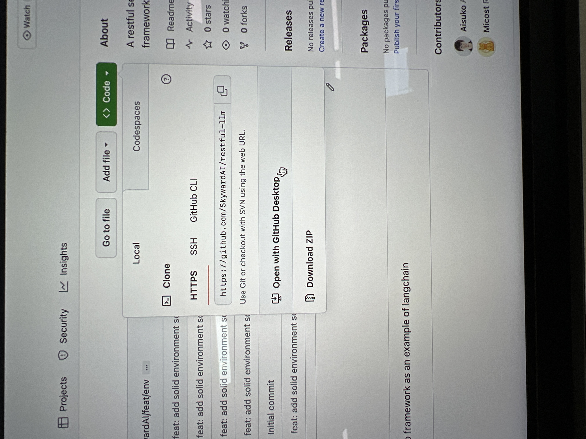
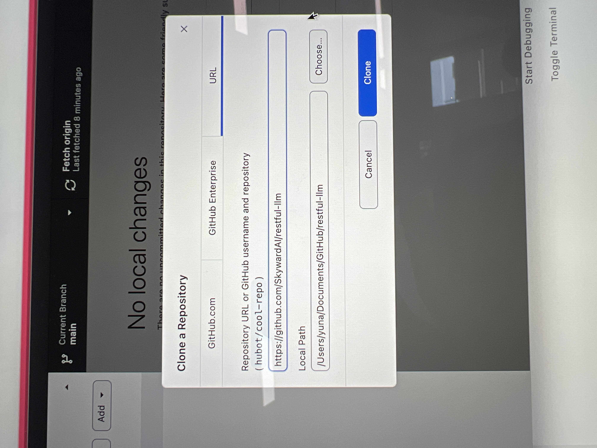
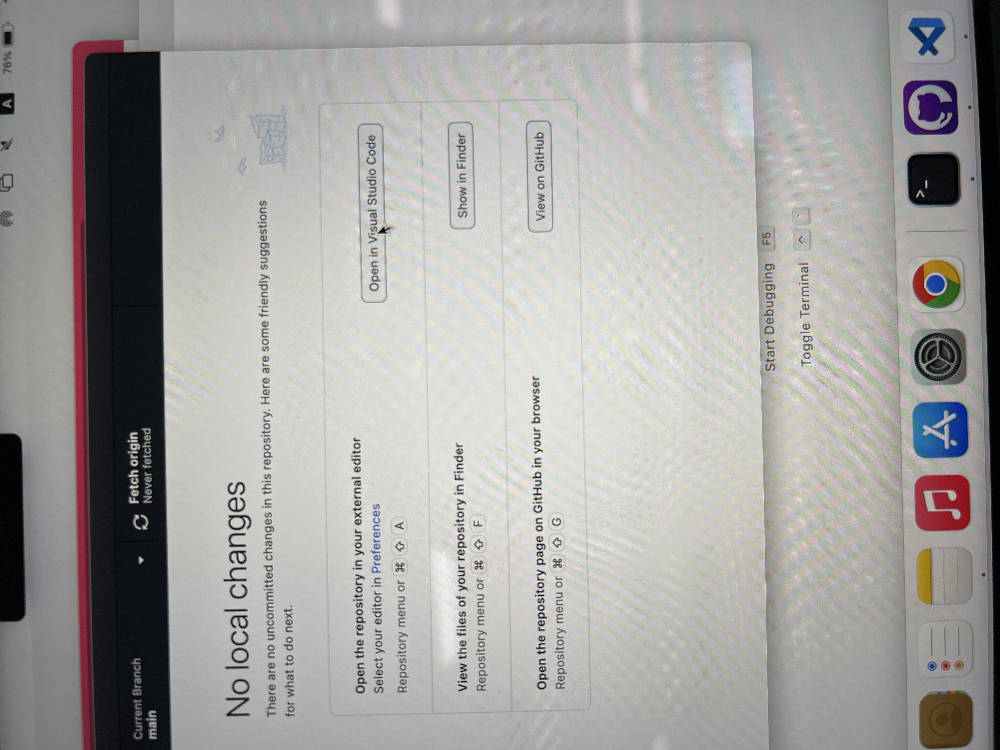
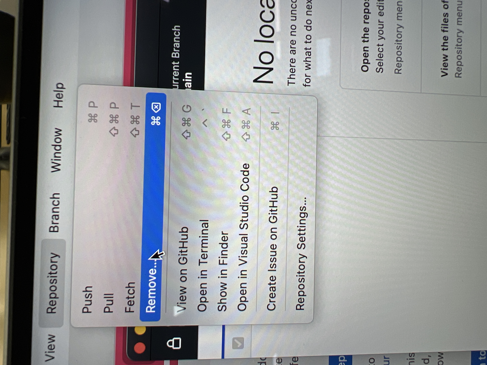

# ✅ How to use GitHub Desktop


Starting with **Download a project from GitHub**


## <mark style="color:blue;">How to clone a project to local environment?</mark>

Step by step:

1. Find your project
2. Click "code"-> Open withGitHub Desktop

3. "Clone a Repository"-> choose your local path to store it-> "Clone"

<figure><figcaption></figcaption></figure>

## <mark style="color:blue;">How to open the project you've downloaded from GitHub?</mark>

Click the button " Open in Visual Studio Code"

<figure><figcaption></figcaption></figure>

## <mark style="color:blue;">How to remove a project using GitHub Desktop?</mark>

Open GitHub Desktop, click " Respository" -> "Remove"

<figure><figcaption></figcaption></figure>

