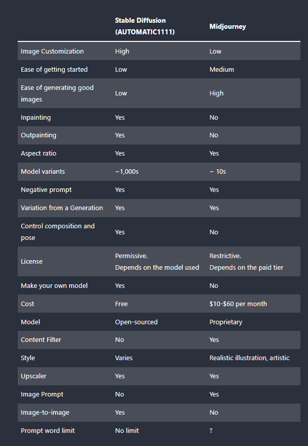

# ⚙ Midjourney vs Stable Diffusion

Midjourney is a web service that makes stunning AI pictures using words. It is similar to Stable Diffusion, but there are some differences. Midjourney can only be used on the internet, and you have to pay for it.&#x20;

Unlike Midjourney, there are multiple ways to use Stable Diffusion, such as using AUTOMATIC1111, A popular GUI for Stable Diffusion.

## What is GUI?



A graphical user interface(GUI) is a type of user interface that allows users to interact with electronic devices through graphical icons and audio indicators, instead of text-based UIs or typed command labels. GUIs were introduced in response to the perceived difficulty of command-line interfaces(CLIs), which require users to type commands on a computer keyboard.

GUIs use visual elements, such as icons, buttons, and menus, to represent actions that users can take and information that is relevant to them.

GUIs can be used with a variety of input devices, such as a mouse, keyboard, touch screen, or voice commands.

GUIs are now the default for nearly every commercial digital product, from personal computers and mobile devices to TVs, gaming consoles, and refrigerators.

The ultimate purpose of GUIs is to allow humans to interact with a device’s underlying code by separating us from the technical details and presenting a simplified interface to the user. This process is called abstraction and is a key concept when designing and building interfaces.

<figure><figcaption></figcaption></figure>

Often, different GUIs are layers inside each other. For example, if streaming music using Spotify in your web browser, you are working with the Spotify web app GUI(in orange below), which is inside the Google Chrome browser GUI(in green), which is inside your Mac's operating system GUI(in bule).

<figure><figcaption></figcaption></figure>

## Show the comparison between Stable Diffusion and Midjourney



<figure><figcaption></figcaption></figure>

### Which one should I use?

**Midjourney is for you if**

* You want to generate stunning images without a deep learning curve.
* You are busy and cannot afford the time to set up and learn the models.
* You like the Midjourney styles.
* You are looking for an out-of-box AI image solution.
* You don’t mind paying a subscription fee.
* You are ok with their terms of use.

**Stable Diffusion is for you if**

* You want a completely free solution.
* You want to run everything locally.
* You are tech-savvy.
* You like tinkering with your setup, trying out model combinations, and using new tools.
* You need the image-editing capability.
* You prefer open-source tools.
* You want more control over your images.

\
\
