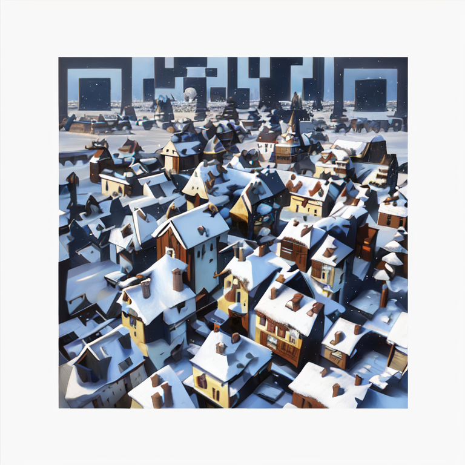
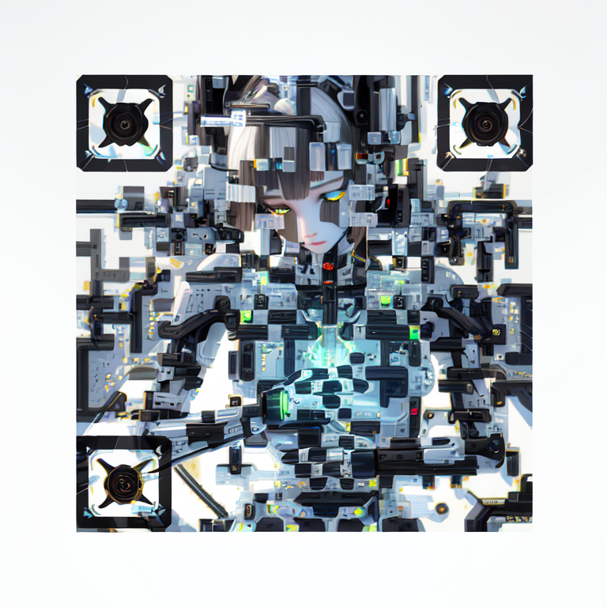

# ⚙ Creative QR Codes with ControlNet


reference: [https://stable-diffusion-art.com/qr-code/#Japanese\_girl](https://stable-diffusion-art.com/qr-code/#Japanese\_girl)


## **Table of contents**

* <mark style="color:blue;">Step 1:</mark> Clone a project from GitHub
* <mark style="color:blue;">Step 2:</mark> Open with GitHub Desktop. Click "Clone"
* <mark style="color:blue;">Step 3:</mark> Install some "Plug-in-board", such as "resource"
* <mark style="color:blue;">Step 4:</mark> Cick terminal input"make prepare" -->"enter"
* <mark style="color:blue;">Step 5:</mark> In termal, input"make run" -->"enter"
* <mark style="color:blue;">Step 6:</mark> Go to img2img to finish the steps.

## 1.Clone a project from GitHub

<figure><figcaption></figcaption></figure>

## 2.Open with GitHub Desktop. Click "Clone"

<figure><figcaption></figcaption></figure>

## 3.Install some "Plug-in-board", such as "resource".

<figure><figcaption></figcaption></figure>

## 4.Cick terminal input"make prepare" -->"enter"

<figure><figcaption></figcaption></figure>

## 5.In termal, input"make run" -->"enter"

Then it will generate a URL like: _http://127.0.0.1:7860, click it to go to_ stable diffusion_._

## 6.Go to img2img

Here are the prompt of Mechanical girl:

**prompt**: 1mechanical girl,ultra realistic details, portrait, global illumination, shadows, octane render, 8k, ultra sharp,intricate, ornaments detailed, cold colors, metal, egypician detail, highly intricate details, realistic light, trending on cgsociety, glowing eyes, facing camera, neon details, machanical limbs,blood vessels connected to tubes,mechanical vertebra attaching to back,mechanical cervial attaching to neck,sitting,wires and cables connecting to head

**negative prompt**: ugly, disfigured, low quality, blurry

**Upload the QR code to the img2img canvas.**

<figure><figcaption></figcaption></figure>

Enter the following image-to-image settings.

* **Resize mode**: Just resize
* **Sampling method**: DPM++2M Karras
* **Sampling step**: 50
* **Width**: 768
* **Height**: 768
* **CFG Scale**: 7
* **Denoising strength**: 0.75

<figure><figcaption></figcaption></figure>

**Upload the QR code to ControlNet‘s image canvas.**

<figure><figcaption></figcaption></figure>

**Enter the following ControlNet settings.**

* **Enable**: Yes
* **Control Type**: Tile
* **Preprocessor**: tile\_resample
* **Model**: control\_xxx\_tile
* **Control Weight**: 0.87
* **Starting Control Step**: 0.23
* **Ending Control Step**: 0.9

<figure><figcaption></figcaption></figure>

Press **Generate**. -->click"save" -->click"download"

When you are successful, click termal in VS Code, then "control + C" to finish the working.

Here are our outputs. High five\~\~\~

<figure><figcaption></figcaption></figure>

 

<figure><figcaption></figcaption></figure>

