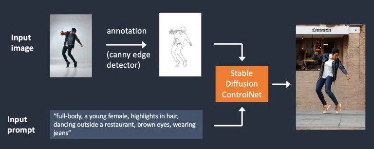

# ⚙ edge detection and human pose detection

ControlNet can do: Controlling image generation with (1) edge detection and (2) human pose detection

## Edge detection example

Using the Canny edge detector, an image containing the detected edges is then saved as a control map. It is fed into the ControlNet model as an extra conditioning together with the text prompt, and images are generated based on these two conditionings.

<figure><figcaption></figcaption></figure>

## Human pose detection example

<mark style="color:orange;">**Openpose**</mark> is a fast keypoint detection model that can extract human poses like positions of hands, legs, and head. Below is the ControlNet workflow using OpenPose. Keypoints are extracted from the input image using OpenPose, and saved as a control map containing the positions of key points. It is then fed to Stable Diffusion as an extra conditioning together with the text prompt. Images are generated based on these two conditionings.

<figure><figcaption></figcaption></figure>

## Difference between using Canny edge detection and Openpose?

The Canny edge detector extracts the edges of the subject and background alike. It tends to translate the scene more faithfully. You can see the dancing man became a woman, but the outline and hairstyle are preserved.

OpenPose only detects human key points such as positions of the head, arms, etc. The image generation is more liberal but follows the original pose.

