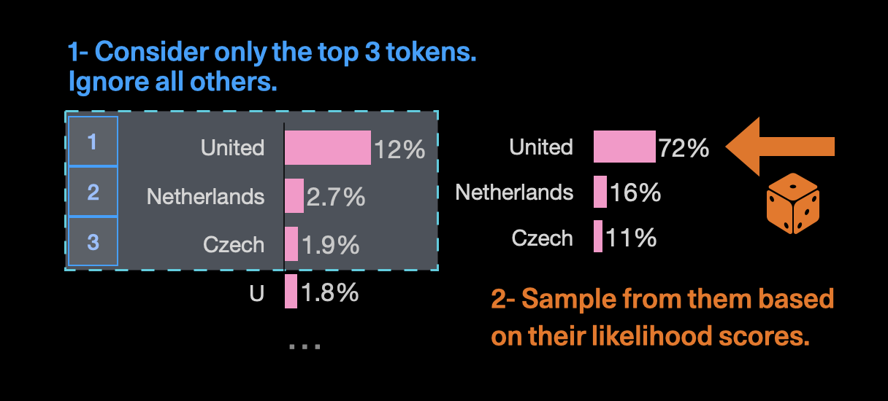
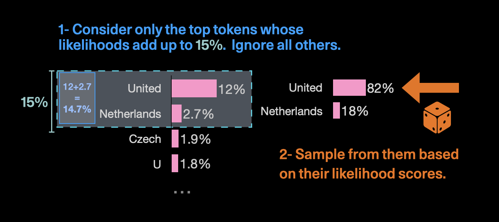

# ⚙ LLM Parameters Demystified


[https://txt.cohere.com/llm-parameters-best-outputs-language-ai/](https://txt.cohere.com/llm-parameters-best-outputs-language-ai/)


## Model

The performance of a pre-trained language model depends on its size. The bigger the model, the better the quality of the output, but it comes at the cost of speed and money.

With the Cohere platform, you can access two types of generative models: the base models (`xlarge` or `medium`) and the command models (`command-xlarge` and `command-medium`).&#x20;

The **smaller models** are cheaper to use and return an **output faster** than the larger models. They are used for **simpler tasks**, like _classification_. The <mark style="color:blue;">**larger models**</mark> are useful for <mark style="color:blue;">**creative content generation**</mark>.

### Number of Tokens 

There’s also a natural limit to the number of tokens the model can produce. Smaller models can go up to 1024 while larger models go up to 2048.

### Temperature 

It has probabilities for all the different words that could follow and then selects the next word to output. The Temperature setting tells it which of these words it can use.

<mark style="color:red;">**Temperature 0**</mark> --> makes the model _**deterministic,**_ it limits the model to use the word with the highest probability. For example, "The sky is", you can run it over and over and get the same output--“blue” or “the limit”.

Increase the temperature, the limit softens, allowing it to use words with lower and lower probabilities until at a <mark style="color:red;">**Temperature=5,**</mark> it’s biased towards lower probabilities. For example, "The sky is", it might generate “tarnished” if you run it enough times.

Running Generate on the prompt “The sky is” at a <mark style="color:green;">Temperature of 0</mark> gives us the same output each time - _The sky is **the limit with this one.**_

At <mark style="color:green;">Temperature 0.5</mark>[<mark style="color:green;">,</mark>](#user-content-fn-1)[^1] we see more variety, although still fairly standard -

_The sky is **the limit**_

_The sky is **blue**_

_The sky is **overcast**._

At <mark style="color:green;">Temperature 1</mark>, things start getting interesting, but nothing too crazy -

_The sky is **not the limit**_

_The sky is **almost perfectly blue**_

_The sky is **grey and dreary today**_

At <mark style="color:green;">Temperature 5</mark>, the highest setting, we enter the realm of fantasy -

_The sky is **clear, the water smooth, and it's an unimaginably long way to go before the dolphins decide to give up their vertical quest.**_

### Top-k and Top-p 

Top-k and Top-p are the two other ways to pick up the output token.

<mark style="color:red;">Top-k</mark> tells the model to pick the next token <mark style="color:red;">**from the top ‘k’ tokens**</mark> _in its list_, sorted by probability.

Consider the input phrase - “The name of that country is the”. The next token could be “United”, “Netherlands”, “Czech”, and so on, with varying probabilities. There may be dozens of potential outputs with decreasing probabilities but if you <mark style="color:red;">set k as 3</mark>, you’re telling the model to only pick from <mark style="color:red;">the top 3 options</mark>.

<figure><figcaption></figcaption></figure>

So if you ran the same prompt a bunch of times, you’ll get United very often, and you’ll get a smattering of Netherlands or Czech, but nothing else.

If you <mark style="color:red;">set k to 1</mark>, the model will only pick <mark style="color:red;">the top token</mark> (United, in this case).

<mark style="color:green;">**Top-p**</mark> is similar but picks from the top tokens based on the sum of their probabilities. So, for the previous example, if we set p as <mark style="color:green;">0.15</mark>, then it will only pick from United and Netherlands as their probabilities add up to 14.7%.

<figure><figcaption></figcaption></figure>

Top-p is more dynamic than top-k and is often used to exclude outputs with lower probabilities. So if you set p to <mark style="color:green;">0.75</mark>, you <mark style="color:green;">exclude</mark> the <mark style="color:green;">bottom 25%</mark> of probable outputs.

### Stop Sequences 


[https://txt.cohere.com/llm-parameters-best-outputs-language-ai/](https://txt.cohere.com/llm-parameters-best-outputs-language-ai/)


A stop sequence is a string that tells the model to step generating more content. It is another way to control how long your output is.

So, for example, if I prompt the model with "The sky is" and I enter a full stop (.) as a stop sequence, the model stops generating text once it reaches the end of the sentence, even if the number of tokens limit is much higher.

This pairs well with prompts where you include a couple of examples. So let's add an example, when you generate text in a certain pattern, you add a certain string to the examples, and then use that string as a stop sequence.

<figure><figcaption></figcaption></figure>

In this example, when you want to stop after genarating a <mark style="color:red;">**hashtag**</mark>. You don't want it to keeping going and generate new posts and hashtags. So, you can split the examples with the string'--' and use that as your stop sequence. By try this in the <mark style="color:red;">**Cohere**</mark> playground with and without the stop sequence.

[^1]: 
